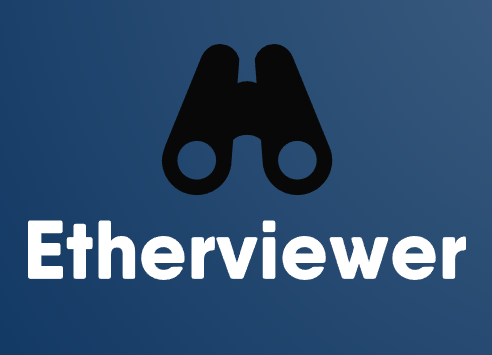

# Etherviewer

## Overview
Etherviewer is a smart contract visuizer tool, providing shareable auto-generated UI for smart contracts. It provides shareable UIs for smart contracts, which can be used requiring any setup or configuration. Useful for people who lack technical expertise or awareness regarding blockchain or smart contracts. A user can generate the UI by uploading the contract details which includes address, network and the json artifact file. The data is stored on a decentralized manner on IPFS-Filecoin and a shareable link is provided to the user. This can be shared with other users who wish to interact with or view the smart contract functions. Etherviewer inherently provides RPCs for most EVM networks and the user can readily query data using etherviewer. For state mutating functions, requires the user to connect their Metamask wallet to send the transaction.This application is built using Next.js and TailwindCSS. It also uses Web3.storage for storing data in a decentralized manner on IPFS-Filecoin.
It uses ethers library for smart contract interaction and parsing ABI and in order to host a static version of the frontend, we used the Spheron network protocol.

The Devpost Submission Link is:- https://devpost.com/software/etherviewer

